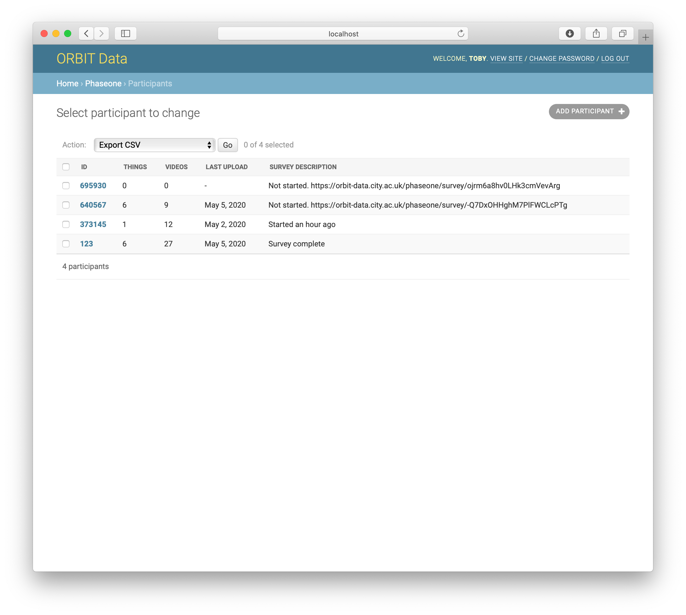
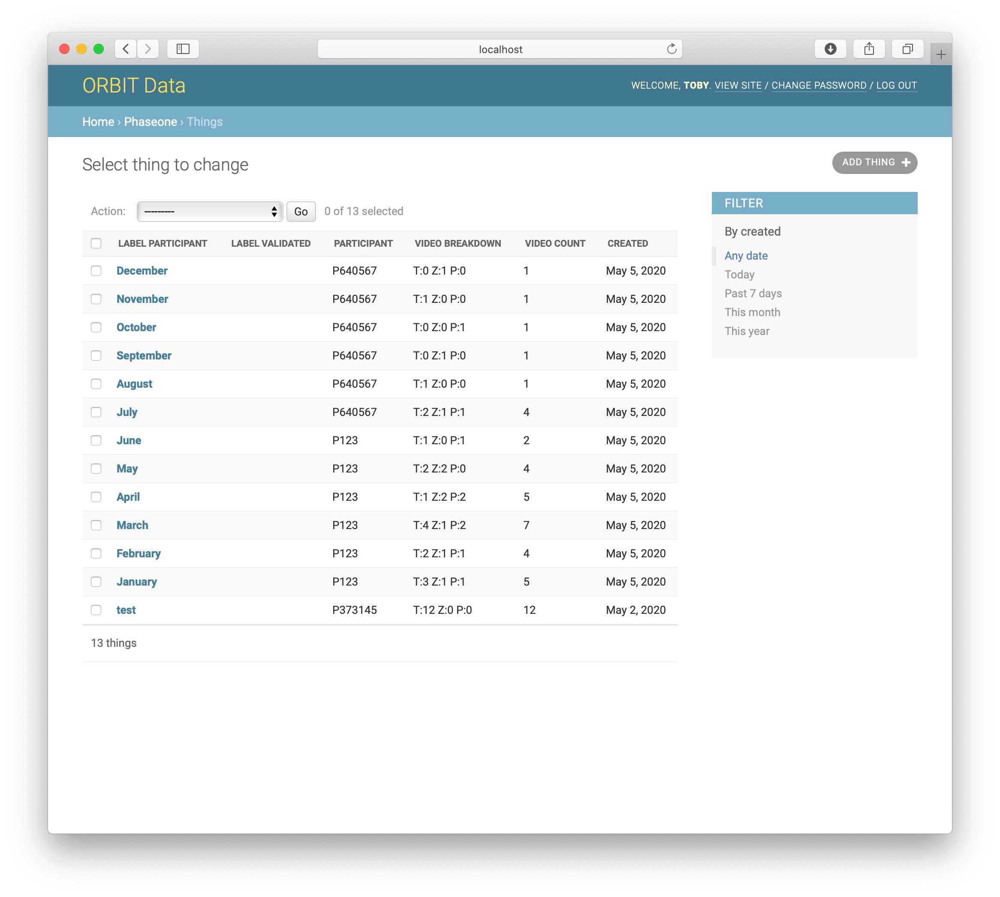
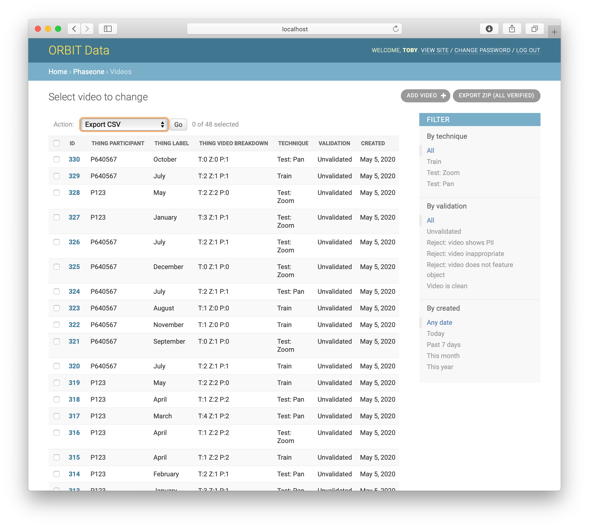
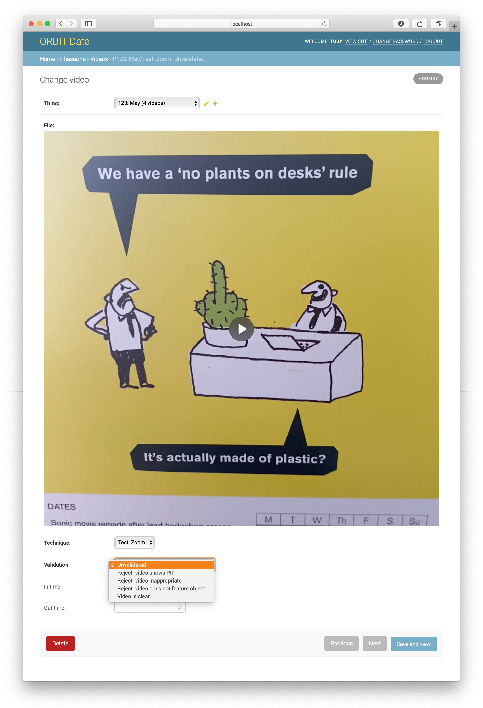

# ORBIT Data

A web-app to collate and administrate the ORBIT dataset. Comprises REST API for data upload from native clients, and Admin interface for verification and export of the data.

Built with Python using the Django framework. Provisioning for a CentOS host.

iOS native client: [ORBIT Camera](https://github.com/tobyspark/ORBIT-Camera)

Developed by Toby Harris – https://tobyz.net  
For ORBIT Project Name – https://orbit.city.ac.uk  
At ***REMOVED*** – https://hcid.city https://www.city.ac.uk  
Funded by Microsoft AI for Accessibility – https://www.microsoft.com/en-us/research/blog/wheres-my-stuff-developing-ai-with-help-from-people-who-are-blind-or-low-vision-to-meet-their-needs/

## Features

### Concepts

`orbit` The overall infrastructure for the web app. Notably `urls.py` for routing, and the self-described `settings.py`. The ORBIT specific part of the generic Django project, `orbit/orbit`.

`pilot` The models, end points, etc. used to conduct the Pilot study. A Django app, `orbit/pilot`

`phaseone` The models, end points, etc. used to conduct the Phase One study. A Django app, in a folder. A Django app, `orbit/phaseone`

`phasetwo` The models, end points, etc. used to conduct the Phase Two study. A Django app, in a folder. A Django app, `orbit/phasetwo`

`User` Used to regulate API access. A client app can ship with user credentials that the server will authenticate, and from this first contact create a new user to allow and identify further access. A Django model, `django.contrib.auth.models.User`

De-activating a User (option in Admin interface) or actually deleting the record has the consequence of barring futher API access with those credentials. This way, a Participant's data can be kept, while locking out their client's access. A Django model, in `orbit.phaseone.models`

`Participant` A study participant, i.e. someone who has given consent and is using a client app to contribute to the dataset. Created with a randomised ID. A `Participant` is optionally linked to a `User`: the two are created together, enabling API access and anonymised record-keeping, but the API access part can be removed. Each participant is assigned a Collection Period, within which the API will allow their contributions. A Django model, in `orbit.phaseone.models`. Export to CSV code in `orbit.phaseone.admin`.

`Thing` Something that a participant has identified as worthy of inclusion in the dataset. The participant will supply a label for the thing ("what is it?"), and an ORBIT Data user may provide an alternative version suited for the dataset (e.g. anonymised). A Django model, in `orbit.phaseone.models`

`Video` A video file, of a thing, with a filming technique. The uploaded file is given an anonymised filename on upload. The video is then verified by an ORBIT Data user, setting a validation status (e.g. 'Clean', 'Reject: contains PII'). Videos also have optional in+out points, that were used in the Pilot to trim videos with PII at the beginning and/or end (required FFmpeg, not installed on production server). Phase One export does not use these, but if needed the pieces are there. A Django model, in `orbit.phaseone.models`. Export to ZIP code in `orbit.phaseone.admin`.

Deleting a `Video` record will delete the corresponding video file. Deleting a `Thing` record will also delete all videos of it. Deleting a `Participant` will also delete their `Thing`s and `Video`s of that thing.

### Webpages

- `survey/<token>` A survey web page for each Participant. The personalised URL can be obtained from the Admin Participant screen.
- `admin` The ORBIT Data interface for the research team. See below.

### API Endpoints

- `createparticipant` Create a new User and Participant pair. Requires user add permission.
- `thing` Create, read, update and delete the logged-in participant's Things.
- `video` Create, read, update and delete the logged-in participant's Videos.

### Admin interface

On first use, go to `/admin` and log in using the superuser account created on server provisioning. Create a user account for each team member requiring access.

`AUTHENTICATION AND AUTHORIZATION` → `Users` → `ADD USER +` (top-right button)

Set them as `staff` to be able to access the admin interface, and grant required permissions, e.g. `phaseone | video | can view video`

#### Collection Period screen

Actions for selected item: Make selected period default for new participants

#### Participant screen



Actions for selected items:

- export a CSV of Participant data. With PII decryption key supplied, will export PII fields including survey.
  ```
  id,name,email,age,gender,vision_light_perception,...
  732709,Toby Test,test@example.com,-,-,-,...
  ```
- change selected participants collection period to _first collection period_
- change selected participants collection period to _nth collection period_

#### Things screen



#### Videos screen



Action for selected items: exports a ZIP of selected files, with a JSON catalogue file. Note will export selected items regardless of verification status.

`EXPORT ZIP (ALL VERIFIED)` Button (top-right). As above, but will export all `clean` videos, regardless of what's selected. i.e. this is what to press to get the ML dataset.

#### Video screen



## Version history

v2.0

- Phase Two app, routing
- Video uploads check for previous success. Client sees successful upload. Server does not have duplicated videos. Handles client re-attempting upload when previous success response not received.
- Video model `technique` gains `Test`.
- Participant model has `charity_choice`.

v1.3

- Export ZIP reworked for production. Does not create temporary file; NGINX, UWSGI settings.

v1.2

- Named Collection Periods supercede per-Participant 'study_start' and 'study_end' dates.
- Admin page to manage Collection Periods, including which is the default to be assigned to new Participants
- Participants admin page can bulk-change Collection Period assignment

v1.1

- As per ORBIT Camera iOS app v1.1
- Participant model has `in_study` for easily excluding test, abandoned accounts etc.
- Participant model has `study_start` and `study_end` dates outside of which the `Things` and `Videos` endpoints will not permit access
- `Participant` endpoint to communicate those dates to the client
- User records can be deleted while keeping the corresponding participant

v1.0

- As per ORBIT Camera iOS app v1.0
- Phase one study launch May 2020

## Development

To install locally (these are high-level notes, refer to Production instructions and provisioning script if needed) –

1. Create and activate a Python virtual environment
2. Clone the git repo alongside it
3. `pip install` the requirements file
4. Create MEDIA_ROOT directory for uploads
5. Set appropriate environment variables. In production, a `.env` file is used. For development, these can be set via shell exports as part of a run server script. See below.
6. Run the Django development server

The following is an example for the fish shell, on macOS. A disk image containing a volume named `ORBIT Data`has been made and opened, it contains `static` and `media` directories. A disk image containing a volume named `ORBIT Keys` has been made and opened, it contains both PII keys (you can skip the decrypt key line in the script if wanted). After the keys have been read, that disk image can be closed.

```
cd (mdfind -name 'Orbit-Data')
source ./env/bin/activate.fish
set -x STATIC_ROOT /Volumes/ORBIT\ Data/static
set -x MEDIA_ROOT /Volumes/ORBIT\ Data/media
set -x PII_KEY_PUBLIC (cat /Volumes/ORBIT\ Keys/orbit-pii-public.pem | string split0)
set -x PII_KEY_PRIVATE (cat /Volumes/ORBIT\ Keys/orbit-pii-private.pem  | string split0)
cd orbit/
python manage.py runserver 0:8000
```

Note fish-ism `| string split0` to handle multiline var, otherwise converts newlines to list, i.e. spaces

To test the API endpoints with client apps, [ngrok](https://ngrok.com) is invaluable. To invoke with HTTPS only –

```
./ngrok http --bind-tls=true 8000
```

## Production

To provision a CentOS server –

1. Get SSL cert and add to `orbit_nginx.conf` e.g.
   ```
   server {
       listen 443 ssl;
       ssl_certificate /etc/nginx/ssl/orbit-data-host.crt;
       ssl_certificate_key /etc/nginx/ssl/orbit-data-host.key;
   ```
1. As root, create orbit user
   ```
   adduser orbit
   passwd orbit
   ```
1. As orbit, create SSH key for log-in to GitHub
   ```
   mkdir .ssh
   nano .ssh/id_rsa
   nano .ssh/id_rsa.pub
   chmod -R go-rwx .ssh
   ```
1. Load SSH key
   ```
   eval "$(ssh-agent -s)"
   ssh-add ~/.ssh/id_rsa
   ```
1. Clone repo
   ```
   git clone git@github.com:tobyspark/orbit_data.git
   ```
1. Create `.env`  
   Create a `.env` configuration file for the server based on the template.
   `cp template.env .env`
   Edit the file to set variables appropriately. Personally Identifiable Information (PII) keys need to be in single line SSH form, given current host constraints of `systemd v219 EnvironmentFile`.

   - `ORBIT_PRODUCTION` The web app will start with debug mode turned off if this variable is set (i.e. remove for dev machine)
   - `HOST` The hostname of the server. In production, restricts the web app to requests to this host.
   - `DJANGO_SECRET_KEY` A random key unique to this installation. e.g. in Python3 `secrets.token_urlsafe` will produce a suitable key.
   - `STATIC_ROOT` The directory `nginx` will map to `/static`. Ensure the path has a trailing slash.
   - `MEDIA_ROOT` The directory the web app will save uploads to.
   - `PII_KEY_PRIVATE` If you wish to run the server with decryption key loaded, set it here. You might want to do this on a machine run by a researcher, having backed up and copied across the production database and media directory.
   - `PII_KEY_PUBLIC` The public PII key the server will use to (one-way) encrypt the PII fields it receives.

1. As root, run provision script

   ```
   /home/orbit/orbit_data/provision/provision.bash
   ```

   Note: the provisioning script is still somewhat hardcoded for the current production server.

   - It still uses the old project name. For a new build, replace `orbit_webapp` with `orbit_data` in paths.
   - The static and media directories are hardcoded.

1. Create first web app user (or run with a copy of the production database)
   Ensure you are running within the ORBIT Data Python virtual environment  
   `source ./env/bin/activate` or similar
   `python manage.py createsuperuser --email admin@example.com --username admin` with appropriate details
